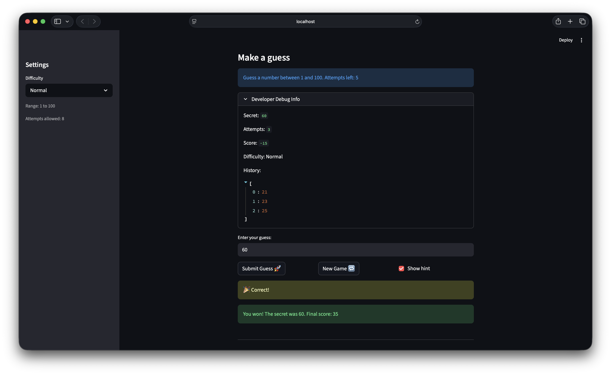

# 🎮 Game Glitch Investigator: The Impossible Guesser

## 🚨 The Situation

You asked an AI to build a simple "Number Guessing Game" using Streamlit.
It wrote the code, ran away, and now the game is unplayable. 

- You can't win.
- The hints lie to you.
- The secret number seems to have commitment issues.

## 🛠️ Setup

1. Install dependencies: `pip install -r requirements.txt`
2. Run the broken app: `python -m streamlit run app.py`

## 🕵️‍♂️ Your Mission

1. **Play the game.** Open the "Developer Debug Info" tab in the app to see the secret number. Try to win.
2. **Find the State Bug.** Why does the secret number change every time you click "Submit"? Ask ChatGPT: *"How do I keep a variable from resetting in Streamlit when I click a button?"*
3. **Fix the Logic.** The hints ("Higher/Lower") are wrong. Fix them.
4. **Refactor & Test.** - Move the logic into `logic_utils.py`.
   - Run `pytest` in your terminal.
   - Keep fixing until all tests pass!

## 📝 Document Your Experience

- [x] Describe the game's purpose.

  A number guessing game where the player tries to guess a secret number within a limited number of attempts. The game gives hints after each guess and tracks a score.

- [x] Detail which bugs you found.

  1. **Swapped hint messages** — when a guess was too high, the game said "Go HIGHER!" instead of "Go LOWER!", sending players in the wrong direction.
  2. **Attempts off by one** — `attempts` initialized to `1` instead of `0`, making the sidebar show one more attempt than was actually available.
  3. **New game didn't reset status** — after winning or losing, clicking "New Game" left `status` as `"won"`/`"lost"`, so the game was permanently blocked by `st.stop()`.

- [x] Explain what fixes you applied.

  1. Swapped the return messages in `check_guess` in `logic_utils.py` so "Go LOWER!" matches a too-high guess and "Go HIGHER!" matches a too-low guess.
  2. Changed the initial value of `st.session_state.attempts` from `1` to `0` in `app.py`.
  3. Added `st.session_state.status = "playing"` to the new game reset block in `app.py` so the game unblocks correctly on restart.

## 📸 Demo

## 🚀 Stretch Features

- [ ] [If you choose to complete Challenge 4, insert a screenshot of your Enhanced Game UI here]
